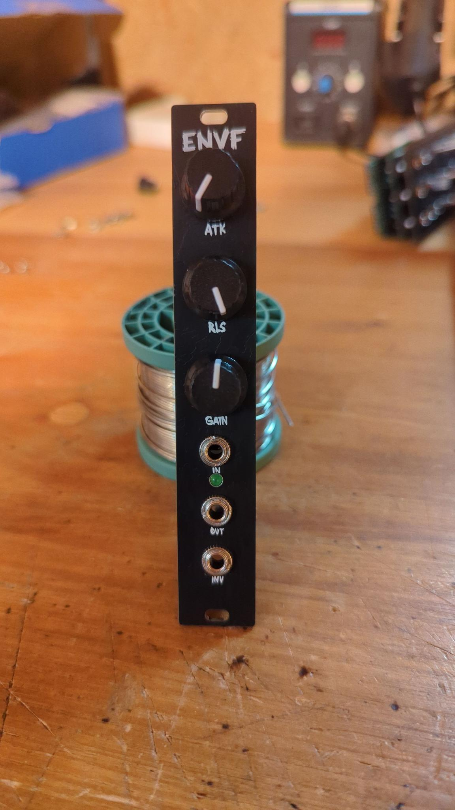
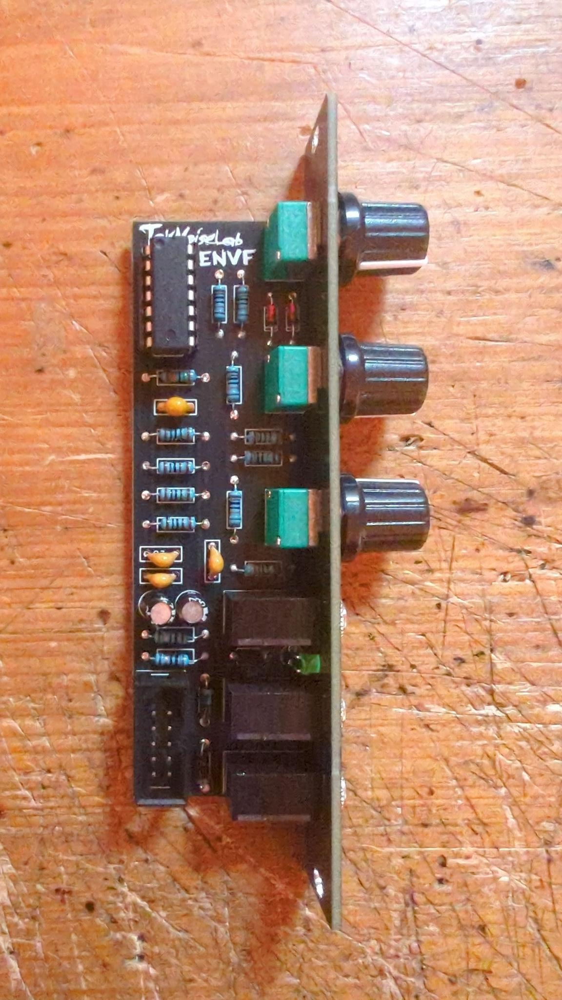

# envf
This is an envelope follower in 4hp based on a peak detector circuit. At the Input it has a high pass filter to remove DC offset and very low frequencies (~19.5Hz).
It has a positive and negative output, which can be used to control the gain of a VCA or to modulate other parameters.
If the Gain is set to the middle position, the output will have nearly the same amplitude as the input signal (provided that the attack rises fast enough). If the Gain is set to the left position, the output will be attenuated, and if it is set to the right position, the output will be amplified (up to ~2x).

# Build
- Order the PCBs from the PCB manufacturer of your choice.
- Order the components from your favorite electronics supplier.
- Solder the components to the PCB and mount the panel.

